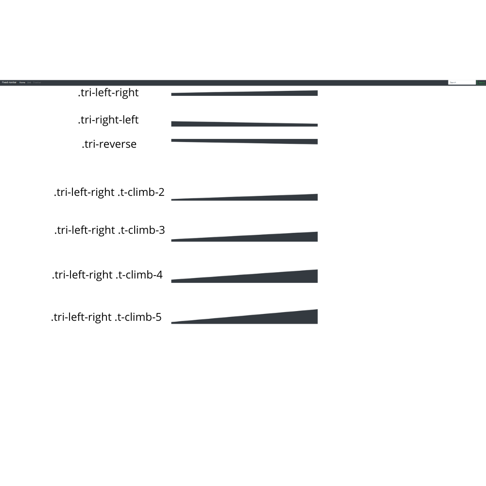

# triangle.css
Triangle.css is an easy responsive Framework for build-in Triangles. Its especialy build as extension for Bootstrap (4), but also it can be used for every other css framework. 

## How to install?
```
<link rel="stylesheet" href="triangle.css">
```

## How does it work?

### Classes
The base-construct of a Triangle looks like this:
```
<div class="tri-fluid">
    <div class="tri-left-to-right b-dark"> </div>
</div>
```
**List of all Classes:**

| **Class**     | **Information** |
| ------------- | --------------- |
| .tri-container **or** .tri-fluid    | Creates a new Container for Triangle(s). (for example: class="col-md-5 tri-container")  |
| .tri-left-right  | Creates a full width Triangle from **left** to **right**  |
| .tri-right-left  | Creates a full width Triangle from **right** to **left**  |
| .tri-reverse     | (Only using for .tri-fluid/container), make Upside-down   |
| .tri

Thats look like this:

