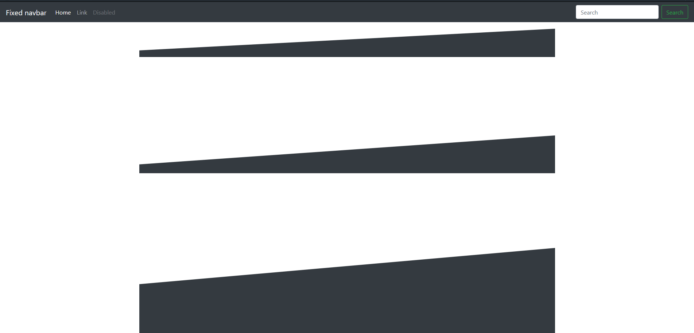

# Triangle.css
Triangle.css is an easy responsive Framework for build-in/pure CSS (**no SVG**) Triangles. Its especialy build as extension for Bootstrap (4/5), but also it can be used for every other CSS Framework. 

## Demo Example
https://cdn.noxomix.de/triangle/example/

## How to install?
```
<link rel="stylesheet" href="triangle.css">
```
(or use this for Quickstart: '``<link rel="stylesheet" href="https://cdn.noxomix.de/triangle/1.1/triangle.css">``')

## How does it work?

### Classes
The base-construct of a Triangle looks like this:
```
<div class="tri-container container"> 
    <div class="tri-left-right bg-dark"> </div>
</div>
```
[The Classnames ``Container`` and ``bg-dark`` are not included in the Triangle.css Framework - so you require Bootstrap, wich you can find in getbootstrap.com]

**List of all Classes:**

| **Class**     | **Information** |
| ------------- | --------------- |
| .tri-container **or** .tri-fluid    | Creates a new Container for Triangle(s). (sample: class="col-md-5 tri-container")  |
| .tri-left-right  | Creates a full width Triangle from **left** to **right**  |
| .tri-right-left  | Creates a full width Triangle from **right** to **left**  |
| .tri-reverse     | (Only using for .tri-fluid/container), make Upside-down   |
| .t-climb-[N]   | Edit the Radius/Climb. Replace N with digits between 1 and 5 (sample: .tri-left-right .tri-climb-3)|
| .tri-mobile      | Coming Soon! |



**Any Questions?**
-> GitHub has the Issue-Function ;)
